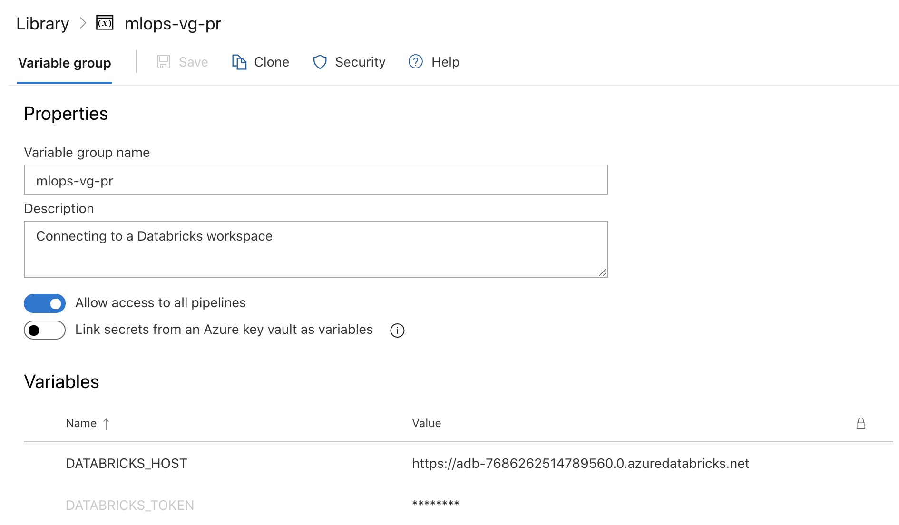
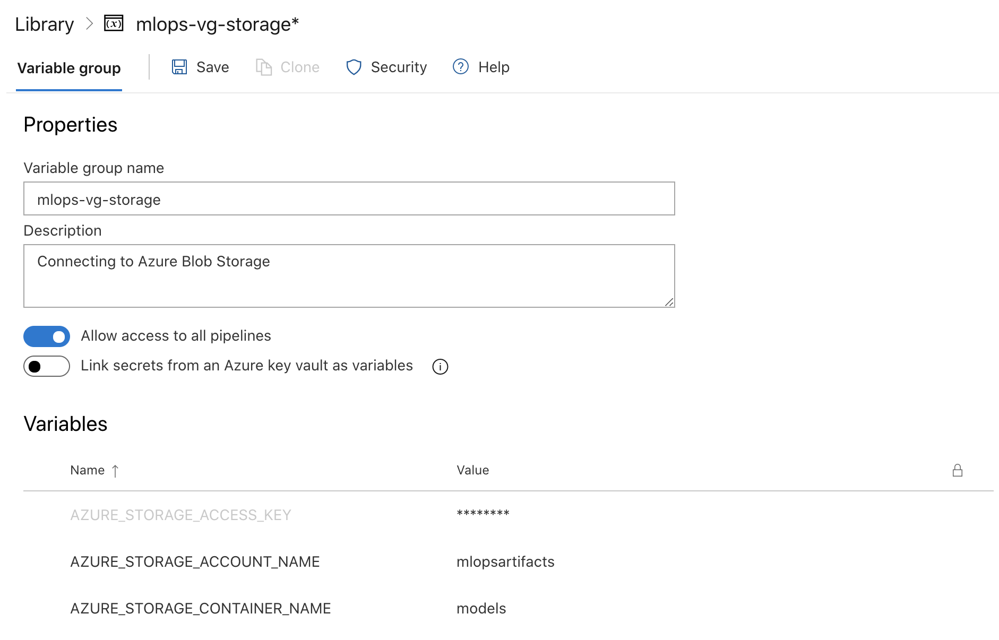

# Getting Started #

This repository contains the following variants of MLOps projects extracted from the Philips Engagement. They all implement the same pattern using Databricks and MLFlow:

- [ExampleDataDriftProject](./mlops_example_data_drift_project.md): An example of schema validation and distribution drift monitoring in Python.

## Setting Up Shared Variables ##

These variables groups are shared among all projects pipelines.

### Databricks Connection ###

Make a `mlops-vg-pr` Variable Group containing:

- `DATABRICKS_TOKEN`: Personal Access Token (PAT) to authenticate against databricks.
- `DATABRICKS_HOST`: Databricks workspace url in the form of `https://<workspace-id>.azuredatabricks.net`

### Blob Storage Connection (Optional) ###

To enable logging model and artifacts from databricks to blob storage, make a `mlops-vg-storage` Variable Group containg:

- `AZURE_STORAGE_ACCESS_KEY`: Azure Blob Storage instance access key
- `AZURE_STORAGE_ACCOUNT_NAME`: Azure Blob Storage account name
- `AZURE_STORAGE_CONTAINER_NAME`: Azure Blob Storage container name
