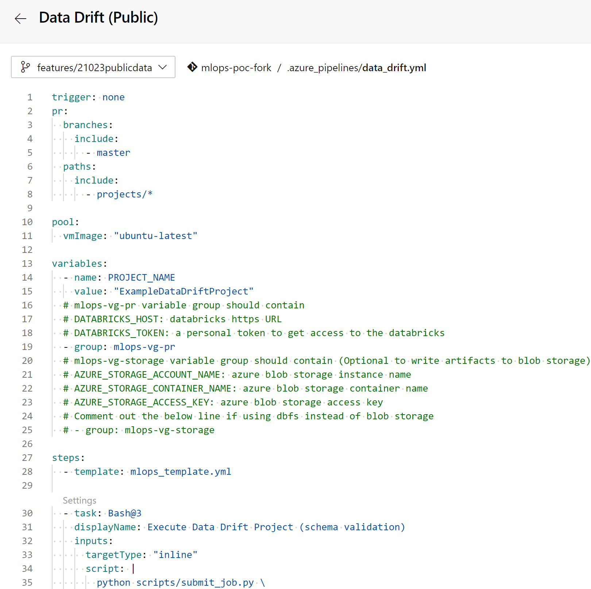
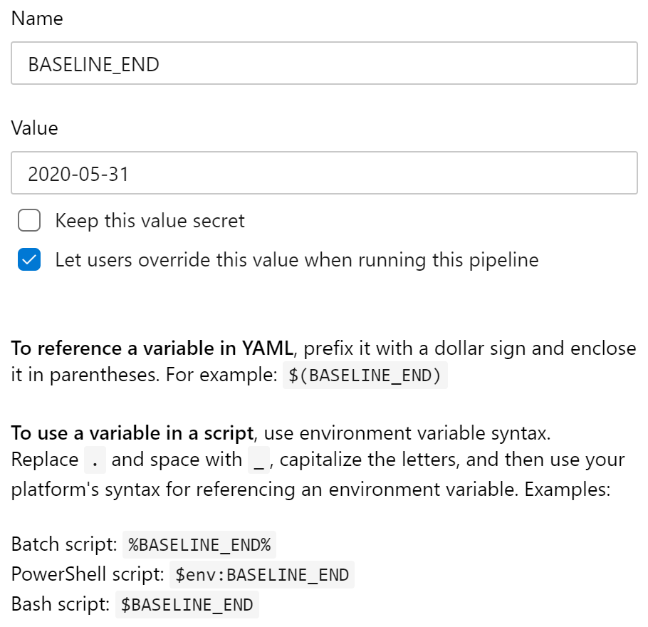
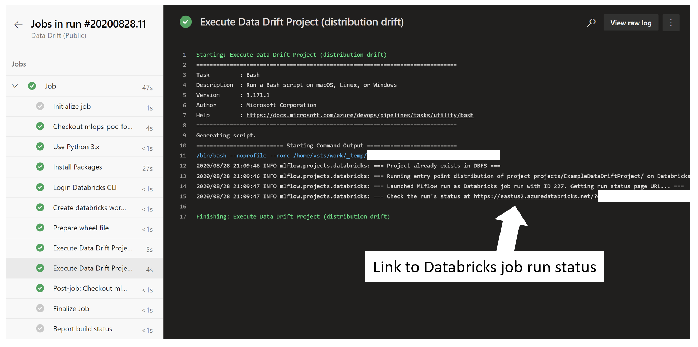
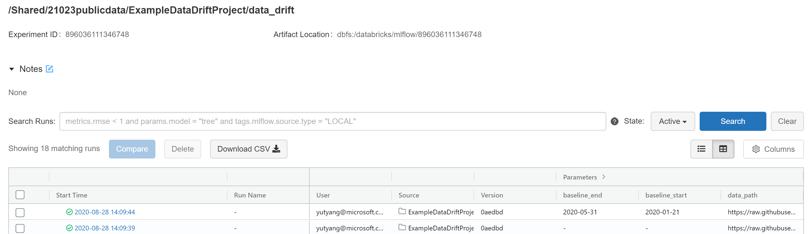
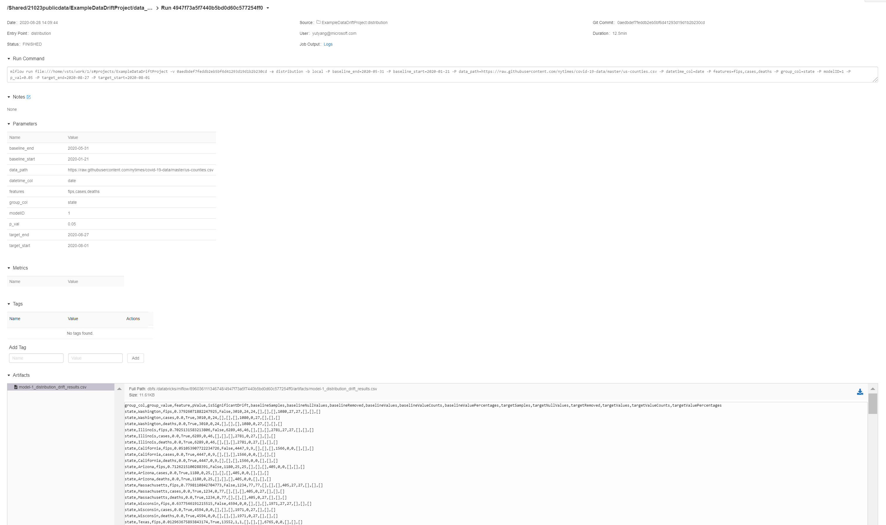

# Running Example Data Drift Project #

## Pipelines ##

There are the pipelines for running the [`ExampleDataDriftProject`](../projects/ExampleDataDriftProject/) in databricks using mlflow.

| Name | Purpose | Variables|
|------|---------|----------|
| [Data Drift Pipeline](../.azure_pipelines/data_drift.yml) | Runs the both schema validation and distribution drift code | `BASELINE_END`, `BASELINE_START`, `DATA_PATH`, `DATETIME_COL`, `FEATURES`, `GROUP_COL`, `MODEL_ID`, `P_VAL`, `TARGET_END`, `TARGET_START` |

## Quickstart Steps ##

1. Setup [`mlops-vg-pr` variable group](./README.md#databricks-connection)

1. Create a pipeline from [Data Drift yml](../.azure_pipelines/data_drift.yml) and add the following pipeline variables with the specified default values, which were selected to work with the example dataset provided. Each variable should be set to "Let users override this value when running this pipeline".

    | Variable Name    | Default Value        | Description                                                                                                                |
    |------------------|----------------------|----------------------------------------------------------------------------------------------------------------------------|
    | BASELINE_END     | 2020-05-31           | End date of the baseline period in YYYY-MM-DD format.                                                                      |
    | BASELINE_START   | 2020-01-21           | Start date of the baseline period in YYYY-MM-DD format.                                                                    |
    | DATA_PATH        | `https://raw.githubusercontent.com/nytimes/covid-19-data/master/us-counties.csv`   | Location of data (either local path or URL).                 |
    | DATETIME_COL     | date                 | Name of column containing datetime information.                                                                            |
    | FEATURES         | fips,cases,deaths    | List of features to perform schema validation for, separated by commas with no spaces.                                     |
    | GROUP_COL        | state                | Name of column to group results by.                                                                                        |
    | MODEL_ID         | 1                    | Appropriate model ID number associated with the data we are performing drift monitoring for (see mon.vrefModel).           |
    | OUT_FILE_NAME    | results.json         | Name of .json file storing results.                                                                                        |
    | P_VAL            | 0.05                 | Threshold value for p-values in distribution drift monitoring. Values below the threshold will be labelled as significant. |
    | TARGET_END       | 2019-08-27           | End date of the target period in YYYY-MM-DD format.                                                                        |
    | TARGET_START     | 2019-08-01           | Start date of the target period in YYYY-MM-DD format.                                                                      |

    

    

1. Manually trigger the created Data Drift Pipeline from any branch.

1. Follow link from Data Drift Pipeline to access Databricks run. Optionally, access it from the Databricks workspace under `/Shared/<branch name>/ExampleDataDriftProject/data_drift`.

1. Wait for the experiment run to complete on Databricks.

1. Access results (stored artifacts) in the completed run page on Databricks.

